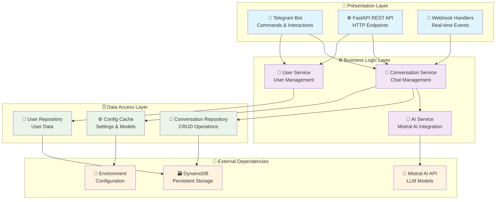
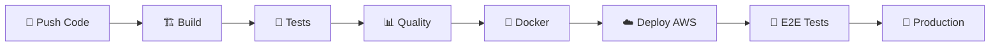

# 🤖Chatbot Telegram avec Mistral AI

<div align="center">

[](./version)
[](https://www.python.org/)
[](https://fastapi.tiangolo.com/)
[](./LICENSE)

[](https://github.com/kybaloo/chatbot/actions/workflows/ci-cd.yml)
[](https://github.com/kybaloo/chatbot/security/code-scanning)
[](./SECURITY.md)
[](./CODE_OF_CONDUCT.md)

[](./CONTRIBUTORS.md)
[](https://github.com/kybaloo/chatbot/issues)
[](https://github.com/kybaloo/chatbot/pulls)
[](https://github.com/kybaloo/chatbot)

</div>

Un **chatbot intelligent** qui connecte Telegram à l'API Mistral AI pour offrir des conversations intelligentes aux utilisateurs. Le projet inclut une **API REST complète** avec FastAPI et est conçu pour être déployé sur **AWS** avec persistance des conversations via DynamoDB.

## 📋 Table des matières

- [🌟 Fonctionnalités](#-fonctionnalités)
- [🏗️ Architecture](#️-architecture)
- [🛠️ Technologies](#️-technologies)
- [🚀 Installation](#-installation)
- [▶️ Utilisation](#️-utilisation)
- [📚 Documentation API](#-documentation-api)
- [🤖 Commandes Bot](#-commandes-bot)
- [🔧 Configuration](#-configuration)
- [🚀 Déploiement](#-déploiement)
- [🧪 Tests](#-tests)
- [📂 Structure du projet](#-structure-du-projet)
- [🔄 CI/CD](#-ci-cd)
- [🛡️ Sécurité](#️-sécurité)
- [🤝 Contribution](#-contribution)
- [📝 Licence](#-licence)

## 🌟 Fonctionnalités

### 🤖 Intelligence Artificielle
- **Chat intelligent** avec l'API Mistral AI (Large, Medium, Small)
- **Personnalisation des modèles** selon les préférences utilisateur
- **Gestion contextuelle** des conversations longues
- **Réponses adaptatives** basées sur l'historique

### 💬 Bot Telegram Avancé
- **Interface intuitive** avec boutons inline et commandes
- **Gestion multi-utilisateurs** avec sessions isolées
- **Historique des conversations** accessible et navigable
- **Webhook temps réel** pour une réactivité optimale
- **Commandes riches** (/start, /help, /history, /settings, /models)

### 🌐 API REST Complète
- **Endpoints RESTful** pour intégrations tierces
- **Documentation interactive** (Swagger/OpenAPI)
- **Authentification** et validation des données
- **Format JSON standardisé** pour tous les échanges

### ☁️ Infrastructure Cloud-Native
- **Déploiement AWS** avec Lambda, API Gateway, DynamoDB
- **Haute disponibilité** et auto-scaling
- **Monitoring** avec CloudWatch
- **Infrastructure as Code** (CloudFormation/SAM)

### 🔧 DevOps & Qualité
- **Pipeline CI/CD Jenkins** automatisé
- **Tests complets** (unitaires, intégration, end-to-end)
- **Containerisation Docker** pour tous les environnements
- **Code quality** avec Black, Flake8, MyPy
- **Versioning sémantique** automatisé

## 🏗️ Architecture

Le projet suit une **architecture en couches moderne** pour garantir la maintenabilité, la testabilité et l'évolutivité :



### Composants principaux

- **Models** : Définitions des entités métier (User, Conversation, Message, AIModel)
- **Services** : Logique métier et orchestration
- **Repositories** : Accès aux données et abstraction de persistance
- **API Routes** : Endpoints REST avec validation
- **Bot Handlers** : Gestion des commandes et interactions Telegram
- **Utils** : Fonctions utilitaires, logging, helpers

## 🛠️ Technologies

### 🐍 Backend & Framework
- **[Python 3.12+](https://www.python.org/)** - Langage principal
- **[FastAPI](https://fastapi.tiangolo.com/)** - Framework web moderne et performant
- **[Pydantic](https://docs.pydantic.dev/)** - Validation et sérialisation des données
- **[Uvicorn](https://www.uvicorn.org/)** - Serveur ASGI haute performance

### 🤖 Intelligence Artificielle & Bot
- **[Mistral AI API](https://mistral.ai/)** - Modèles de langage avancés
- **[Python Telegram Bot](https://python-telegram-bot.readthedocs.io/)** - SDK Telegram Bot API

### ☁️ Cloud & Infrastructure
- **[AWS Lambda](https://aws.amazon.com/lambda/)** - Compute serverless
- **[AWS API Gateway](https://aws.amazon.com/api-gateway/)** - Gestion d'API
- **[AWS DynamoDB](https://aws.amazon.com/dynamodb/)** - Base de données NoSQL
- **[AWS EC2](https://aws.amazon.com/ec2/)** - Machines virtuelles
- **[AWS CloudFormation](https://aws.amazon.com/cloudformation/)** - Infrastructure as Code
- **[Mangum](https://github.com/jordaneremieff/mangum)** - Adaptateur ASGI pour Lambda

### 🔧 DevOps & Outils
- **[Docker](https://www.docker.com/)** - Containerisation
- **[Jenkins](https://www.jenkins.io/)** - CI/CD pipeline
- **[AWS SAM](https://aws.amazon.com/serverless/sam/)** - Déploiement serverless
- **[Black](https://black.readthedocs.io/)** - Formatage de code
- **[Flake8](https://flake8.pycqa.org/)** - Linting
- **[Pytest](https://pytest.org/)** - Framework de tests

## 🚀 Installation

### 📋 Prérequis

- **Python 3.12+** ([télécharger](https://www.python.org/downloads/))
- **Git** ([télécharger](https://git-scm.com/))
- **Docker** (optionnel) ([télécharger](https://www.docker.com/))
- **AWS CLI** (pour déploiement) ([guide d'installation](https://docs.aws.amazon.com/cli/latest/userguide/getting-started-install.html))
- **Compte Telegram** et **token bot** ([guide BotFather](https://core.telegram.org/bots#botfather))
- **Clé API Mistral AI** ([obtenir ici](https://console.mistral.ai/))

### 🔧 Installation locale

#### 1️⃣ Cloner le projet

```powershell
git clone https://github.com/kybaloo/chatbot.git
cd chatbot
```

#### 2️⃣ Configuration de l'environnement

**Option A : Utilisation du script PowerShell (Windows - recommandé)**
```powershell
# Créer l'environnement virtuel et installer les dépendances
.\build.ps1 venv
.\build.ps1 install

# Ou en une seule commande
.\build.ps1 venv; .\build.ps1 install
```

**Option B : Utilisation de Make (Linux/Mac)**
```bash
make venv
source .venv/bin/activate
make install
```

**Option C : Installation manuelle**
```powershell
python -m venv .venv
.venv\Scripts\activate  # Windows
# source .venv/bin/activate  # Linux/Mac
pip install -r requirements.txt
```

#### 3️⃣ Configuration des variables d'environnement

Créez un fichier `.env` à la racine du projet :

```env
# 🌍 Configuration de l'environnement
ENV_NAME=local
LOG_LEVEL=INFO

# ☁️ Configuration AWS
AWS_REGION_NAME=eu-west-3
DYNAMO_TABLE=chatbot-conversations-local

# 🤖 Configuration IA
MISTRAL_API_KEY=votre_cle_mistral_ici

# 📱 Configuration Telegram
TELEGRAM_BOT_TOKEN=votre_token_bot_ici
WEBHOOK_URL=https://votre-domaine.com/webhook/telegram

# ⚙️ Configuration application
CONVERSATION_TTL_DAYS=30
USE_LOCAL_DB=true
```

#### 4️⃣ Configuration du bot Telegram

1. Discutez avec [@BotFather](https://t.me/BotFather) sur Telegram
2. Créez un nouveau bot avec `/newbot`
3. Notez le token fourni et ajoutez-le dans `.env`
4. Configurez les commandes du bot avec `/setcommands` :

```
start - Démarrer une nouvelle conversation
help - Afficher l'aide et les commandes disponibles
history - Consulter l'historique des conversations
settings - Configurer les préférences utilisateur
new - Créer une nouvelle conversation
models - Changer de modèle IA
```

## ▶️ Utilisation

### 🚀 Démarrage rapide

#### Mode développement (local)

```powershell
# Démarrer l'application FastAPI avec reload automatique
make run-dev

# Ou directement avec uvicorn
uvicorn src.main:app --reload --host 0.0.0.0 --port 8000
```

L'application sera accessible sur :
- **API** : http://localhost:8000
- **Documentation** : http://localhost:8000/docs
- **Health check** : http://localhost:8000/

#### Mode production (Docker)

```powershell
# Construire l'image Docker
make build

# Lancer le conteneur
make run-local

# Ou directement avec Docker
docker build -t chatbot:latest .
docker run -p 80:80 -p 8000:8000 --env-file .env chatbot:latest
```

### 🧪 Validation de l'installation

#### Tests automatisés

```powershell
# Tests complets
make test

# Tests unitaires uniquement
make test-unit

# Tests d'intégration
make test-integration

# Validation de la configuration
python scripts/test_config.py
```

#### Test manuel du bot

1. Ouvrez Telegram et recherchez votre bot
2. Envoyez `/start` pour commencer
3. Testez une question : "Bonjour, comment allez-vous ?"
4. Vérifiez l'historique avec `/history`

## ▶️ Exécution

### Localement avec uvicorn (développement)

```bash
# Exécuter l'API FastAPI et le bot Telegram
make run-dev

# Ou avec uvicorn directement
uvicorn src.main:app --reload --host 0.0.0.0 --port 8000
```

### Avec Docker

1. Construire l'image
   ```bash
   make build
   ```
   Ou directement avec docker :
   ```bash
   docker build -t chatbot:latest .
   ```

2. Exécuter le conteneur
   ```bash
   # Avec le Makefile
   make run-local
   
   # Ou directement avec Docker
   docker run -p 80:80 -p 8000:8000 -v $(pwd)/.env:/code/.env chatbot:latest
   ```

### Déploiement sur AWS

```bash
# Déployer l'infrastructure sur AWS
make deploy env=dev

# Configurer le webhook Telegram (uniquement pour prod/preprod)
make setup-telegram-webhook
```

## 📚 Documentation API

Une fois l'application démarrée, la documentation interactive est disponible :

### 🔗 Endpoints principaux

- **📋 Documentation Swagger** : http://localhost:8000/docs
- **📖 Documentation ReDoc** : http://localhost:8000/redoc
- **💚 Health Check** : http://localhost:8000/
- **💬 Chat API** : `POST /chat`
- **📚 Conversations** : `GET /conversations/{user_id}`
- **🔗 Webhook Telegram** : `POST /webhook/telegram`

### 📝 Exemples d'utilisation API

#### Chat avec l'IA
```powershell
# Test du chat via curl
curl -X POST "http://localhost:8000/chat" \
  -H "Content-Type: application/json" \
  -d '{
    "question": "Bonjour, comment allez-vous ?",
    "user_id": "test_user",
    "conversation_id": "conv_123"
  }'
```

#### Récupération des conversations
```powershell
curl -X GET "http://localhost:8000/conversations/test_user"
```

## 🤖 Commandes Bot

Le bot Telegram supporte les commandes suivantes :

| Commande | Description | Utilisation |
|----------|-------------|-------------|
| `/start` | 🚀 Démarrer une nouvelle conversation | Première utilisation du bot |
| `/help` | ❓ Afficher l'aide et les commandes | À tout moment pour obtenir de l'aide |
| `/history` | 📚 Consulter l'historique des conversations | Voir et reprendre d'anciennes conversations |
| `/settings` | ⚙️ Configurer les préférences utilisateur | Personnaliser l'expérience |
| `/new` | ➕ Créer une nouvelle conversation | Démarrer un nouveau sujet |
| `/models` | 🧠 Changer de modèle IA | Choisir entre Mistral Large, Medium, Small |

### 💬 Interaction naturelle

En plus des commandes, vous pouvez simplement envoyer des messages texte au bot pour engager une conversation naturelle avec l'IA.

## 🔧 Configuration

### 📄 Variables d'environnement

Le projet utilise un fichier `.env` pour la configuration. Voici toutes les variables disponibles :

```env
# 🌍 Environnement
ENV_NAME=local                    # Nom de l'environnement (local/dev/prod)
LOG_LEVEL=INFO                    # Niveau de log (DEBUG/INFO/WARNING/ERROR)

# ☁️ AWS Configuration
AWS_REGION_NAME=eu-west-3         # Région AWS
DYNAMO_TABLE=chatbot-conversations # Nom de la table DynamoDB
AWS_PROFILE=default               # Profil AWS (optionnel)

# 🤖 Mistral AI
MISTRAL_API_KEY=your_api_key_here # Clé API Mistral AI (obligatoire)

# 📱 Telegram Bot
TELEGRAM_BOT_TOKEN=your_bot_token # Token du bot Telegram (obligatoire)
WEBHOOK_URL=https://example.com   # URL webhook pour production

# ⚙️ Application
CONVERSATION_TTL_DAYS=30          # Durée de conservation des conversations
USE_LOCAL_DB=true                 # Utiliser une base locale pour dev
ENABLE_TELEGRAM_BOT=true          # Activer/désactiver le bot Telegram
```

### 🎯 Modèles Mistral AI supportés

| Modèle | Description | Utilisation recommandée |
|--------|-------------|-------------------------|
| **mistral-large-latest** | 🚀 Le plus puissant | Tâches complexes, raisonnement avancé |
| **mistral-medium-latest** | ⚖️ Équilibré | Usage général, bon rapport qualité/prix |
| **mistral-small-latest** | ⚡ Rapide et économique | Tâches simples, réponses rapides |

## 🚀 Déploiement

### 🌍 Environnements

Le projet supporte trois environnements :

| Environnement | Description | Branche Git | URL |
|---------------|-------------|-------------|-----|
| **Development** | Tests et développement | `dev` | `https://dev-api.example.com` |
| **Preprod** | Validation avant production | `preprod` | `https://preprod-api.example.com` |
| **Production** | Environnement en production | `main` | `https://api.example.com` |

### ☁️ Déploiement AWS

#### Prérequis déploiement
- AWS CLI configuré avec les permissions appropriées
- AWS SAM CLI installé
- Variables d'environnement MISTRAL_API_KEY et TELEGRAM_BOT_TOKEN définies

#### Déploiement automatique (recommandé)

```powershell
# Déployer vers dev
make deploy env=dev

# Déployer vers preprod
make deploy env=preprod

# Déployer vers production
make deploy env=prod
```

#### Déploiement manuel

```powershell
# 1. Construire le projet
sam build --template infrastructure/template.yaml

# 2. Déployer
sam deploy --resolve-s3 --template-file .aws-sam/build/template.yaml \
  --stack-name "chatbot-stack-dev" \
  --capabilities CAPABILITY_IAM \
  --region eu-west-3 \
  --parameter-overrides \
    EnvironmentName=dev \
    TelegramBotToken=$env:TELEGRAM_BOT_TOKEN \
    MistralApiKey=$env:MISTRAL_API_KEY

# 3. Configurer le webhook (production uniquement)
make setup-telegram-webhook
```

### 🐳 Déploiement Docker

```powershell
# Build local
docker build -t chatbot:latest .

# Run local
docker run -p 8000:8000 --env-file .env chatbot:latest

# Push vers registry
docker tag chatbot:latest your-registry/chatbot:v1.0.0
docker push your-registry/chatbot:v1.0.0
```

## 🧪 Tests

### 🎯 Types de tests

Le projet inclut une suite de tests complète :

```powershell
# 🔬 Tests unitaires (rapides)
make test-unit
pytest tests/models tests/repositories tests/services -v

# 🔗 Tests d'intégration
make test-integration
pytest tests/test_api_integration.py -v

# 🌐 Tests end-to-end
make test-endpoint  # Teste les endpoints déployés

# 📊 Tests avec couverture
pytest --cov=src --cov-report=html --cov-report=term

# 🔍 Tests de qualité du code
make lint    # Vérification avec flake8
make format  # Formatage avec black
```

### 📈 Métriques de qualité

- **Couverture de code** : > 80%
- **Complexité cyclomatique** : < 10
- **Conformité PEP8** : 100%
- **Tests** : Unitaires + Intégration + E2E

## 📂 Structure du projet

```
chatbot/
├── 📋 README.md                    # Documentation principale
├── 📄 requirements.txt             # Dépendances Python
├── 📋 pyproject.toml               # Configuration du projet Python
├── 📄 version                      # Version actuelle
├── 📋 CHANGELOG.md                 # Historique des versions
├── ⚖️ LICENSE                      # Licence MIT
├── 🐳 Dockerfile                   # Image Docker
├── 🔧 Makefile                     # Commandes utilitaires
├── 🔧 Jenkinsfile                  # Pipeline CI/CD
├── 🔧 execute.ps1                  # Scripts PowerShell
├── 🔧 deploy.ps1                   # Script de déploiement
│
├── 🏗️ infrastructure/              # Infrastructure as Code
│   └── 📄 template.yaml            # CloudFormation SAM template
│
├── 📝 scripts/                     # Scripts utilitaires
│   ├── 🧪 test_config.py           # Validation configuration
│   ├── 🔧 setup_ngrok_webhook.py   # Configuration webhook local
│   ├── 🗄️ create_local_table.py    # Création table DynamoDB locale
│   └── 🔍 validate_project.py      # Validation du projet
│
├── 🏗️ src/                         # Code source principal
│   ├── 📱 main.py                  # Point d'entrée FastAPI
│   │
│   ├── 🌐 api/                     # Couche API REST
│   │   ├── 📄 routes.py            # Définition des routes
│   │   └── 📄 __init__.py
│   │
│   ├── 🤖 bot/                     # Bot Telegram
│   │   ├── 📄 telegram_bot.py      # Logique du bot Telegram
│   │   └── 📄 __init__.py
│   │
│   ├── ⚙️ config/                  # Configuration
│   │   ├── 📄 settings.py          # Variables d'environnement
│   │   └── 📄 __init__.py
│   │
│   ├── 🏗️ models/                  # Modèles de données
│   │   ├── 👤 user.py              # Modèle utilisateur
│   │   ├── 💬 conversation.py      # Modèle conversation
│   │   ├── 🧠 ai_model.py          # Modèles IA Mistral
│   │   └── 📄 __init__.py
│   │
│   ├── 🗄️ repositories/            # Couche d'accès aux données
│   │   ├── 📄 base_repository.py   # Repository de base
│   │   ├── 💬 conversation_repository.py # Repository conversations
│   │   └── 📄 __init__.py
│   │
│   ├── ⚙️ services/                # Couche logique métier
│   │   ├── 📄 base_service.py      # Service de base
│   │   ├── 💬 conversation_service.py # Service conversations
│   │   ├── 🧠 ai_service.py        # Service IA Mistral
│   │   └── 📄 __init__.py
│   │
│   └── 🛠️ utils/                   # Utilitaires
│       ├── 📄 helpers.py           # Fonctions auxiliaires
│       ├── 📋 logger.py            # Configuration logging
│       └── 📄 __init__.py
│
└── 🧪 tests/                       # Tests automatisés
    ├── 📄 conftest.py              # Configuration pytest
    ├── 📄 test_main.py             # Tests API principale
    ├── 📄 test_api_integration.py  # Tests d'intégration
    │
    ├── 🏗️ models/                  # Tests des modèles
    │   └── 💬 test_conversation.py
    │
    ├── 🗄️ repositories/            # Tests des repositories
    │   └── 💬 test_conversation_repository.py
    │
    └── ⚙️ services/                # Tests des services
        ├── 🧠 test_ai_service.py
        └── 💬 test_conversation_service.py
```

## 🔄 CI/CD

### 🔧 Pipeline Jenkins

Le projet utilise Jenkins pour l'automatisation complète du cycle de développement :



#### Étapes du pipeline

1. **🔧 Initialisation** - Setup de l'environnement
2. **🧪 Tests unitaires** - Validation du code
3. **📊 Qualité du code** - Formatage et linting
4. **🏗️ Build** - Construction des artefacts
5. **☁️ Déploiement AWS** - Via SAM/CloudFormation
6. **🧪 Tests d'intégration** - Validation des endpoints
7. **🔗 Configuration webhook** - Setup Telegram
8. **📋 Notifications** - Alertes de succès/échec

### 🔀 Workflow Git

- **`main`** → Production automatique
- **`preprod`** → Préproduction automatique
- **`dev`** → Développement automatique
- **`feature/*`** → Tests uniquement

## 🛡️ Sécurité

### 🔐 Authentification & Autorisation
- **Variables d'environnement** pour tous les secrets
- **AWS IAM** avec permissions minimales
- **Secrets Jenkins** pour le CI/CD
- **Validation Pydantic** de toutes les entrées

### 🔒 Protection des données
- **Chiffrement en transit** (HTTPS/TLS)
- **Chiffrement au repos** (DynamoDB)
- **Isolation des environnements**
- **Logs sécurisés** (pas de secrets loggés)

### 🛡️ Bonnes pratiques appliquées
- **Input validation** systématique
- **Error handling** robuste
- **Rate limiting** (future implémentation)
- **Monitoring** continu avec CloudWatch

## 🤝 Contribution

### 🎯 Guide de contribution

1. **📋 Issues** - Signaler un bug ou proposer une fonctionnalité
2. **🍴 Fork** - Créer votre propre copie du projet
3. **🌿 Branch** - Créer une branche feature/bugfix
4. **✅ Tests** - Ajouter/modifier les tests appropriés
5. **🎨 Code style** - Respecter les conventions (Black + Flake8)
6. **📝 Documentation** - Mettre à jour si nécessaire
7. **🔧 Pull Request** - Créer une PR avec description détaillée

### 📏 Standards de qualité

- **Couverture de tests** : Minimum 80%
- **Documentation** : Docstrings pour toutes les fonctions publiques
- **Type hints** : Utilisation systématique
- **Code style** : Conformité PEP8 via Black
- **Commit messages** : Format conventionnel

### 🔄 Workflow de développement

```powershell
# 1. Cloner et setup
git clone https://github.com/kybaloo/chatbot.git
cd chatbot
make venv && .venv\Scripts\activate && make install

# 2. Créer une branche
git checkout -b feature/ma-nouvelle-fonctionnalite

# 3. Développer avec tests
# ... votre code ...
make test  # S'assurer que tous les tests passent

# 4. Qualité du code
make format  # Formatage automatique
make lint    # Vérification du style

# 5. Commit et push
git add .
git commit -m "feat: ajouter nouvelle fonctionnalité"
git push origin feature/ma-nouvelle-fonctionnalite

# 6. Créer une Pull Request sur GitHub
```

## 📝 Licence

Ce projet est sous licence **MIT** - voir le fichier [LICENSE](LICENSE) pour plus de détails.

### 🆓 Utilisation libre

- ✅ **Usage commercial** autorisé
- ✅ **Modification** autorisée  
- ✅ **Distribution** autorisée
- ✅ **Usage privé** autorisé
- ℹ️ **Attribution** requise

---

<div align="center">

**🌟 Si ce projet vous aide, n'hésitez pas à lui donner une étoile ! ⭐**

**Fait avec ❤️ par [kybaloo](https://github.com/kybaloo)**

[](./version)
[](./LICENSE)
[](https://www.python.org/)

</div>
